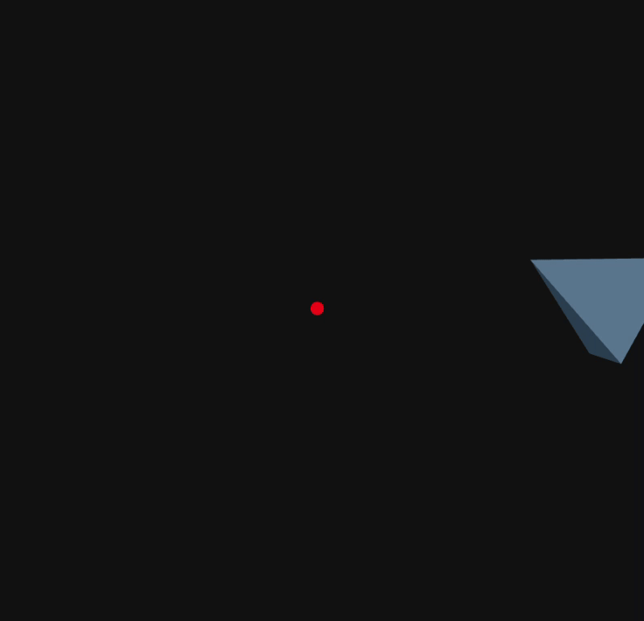

# 🌐 Three.js + React Three Fiber – Transformations

This project demonstrates 3D transformations using **Three.js** via **React Three Fiber**.

## 🔺 Animated Scene

The scene features a 3D object (a tetrahedron) that:

- 🔁 Rotates continuously around its own Y-axis
- 🌍 Orbits around the origin in a circular path using `Math.cos(t)` and `Math.sin(t)`
- 💡 Is illuminated with ambient and directional lighting
- 🧭 Is centered visually and interactively using `OrbitControls`

A red sphere at the origin marks the center of the scene for reference.

## 🛠 Key Concepts

- `Canvas` from `@react-three/fiber` defines the 3D scene
- `useFrame()` updates animation on each render frame
- `useRef()` references the object for transformation
- `OrbitControls` enables camera interaction with the scene
- Lighting is handled with `ambientLight` and `directionalLight`

## 🎞️ Preview

