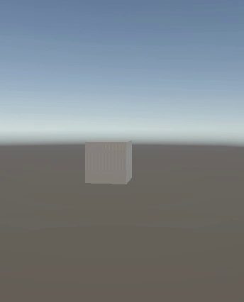

# 🎮 Unity – 3D Transformations

This Unity project demonstrates basic 3D transformations using a cube object and a custom C# script.

## 🔁 Object Behavior

The cube performs the following actions:

1. **Constant Rotation**  

2. **Random Translation**  

3. **Oscillating Scale**  

## 📽 Preview

