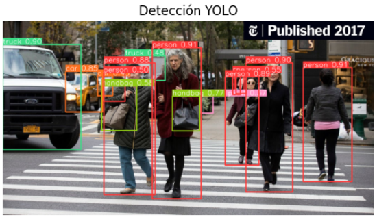

# Avance en clase - Detección de Objetos con YOLO

## Estado de la actividad
Durante la clase se avanzó en la **implementación inicial de YOLOv8** para la detección de objetos en imágenes.  
Se realizó **una prueba con una imagen de ejemplo**, verificando que YOLO funciona correctamente para la detección, generando *bounding boxes* con las clases y probabilidades.

## Link del Colab
[Colab de Avance Intermedio](https://colab.research.google.com/drive/1MhpjZ-KJ2MN1-2xsVsI2KnORF6-iTQYB?usp=sharing)  

---

## Prueba Realizada
- **Imagen de prueba:** Foto con detección YOLO (sin segmentación SAM).  
- **Resultado:** Bounding boxes y clases correctamente detectadas.  

---

## Pendientes
- Integrar el modelo **SAM** para segmentación.  
- Generar visualizaciones combinadas (YOLO + SAM).  
- Completar el **informe final** con análisis, resultados y tabla de conteo.  

## Notas
Este avance confirma que el pipeline de detección funciona correctamente, siendo el próximo paso agregar la segmentación y elaborar el informe.