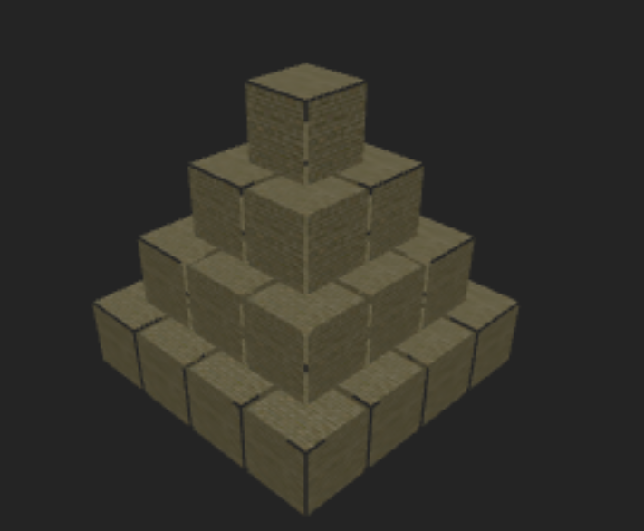
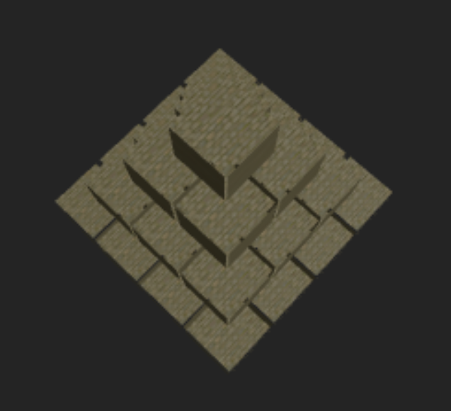

# Ejercicio 2 - Pirámide 3D con React Three Fiber

Este proyecto muestra una **pirámide 3D** construida con cajas y texturas PBR utilizando React Three Fiber.

## Pasos Clave
- Proyecto creado con Vite + React.
- Pirámide construida con `@react-three/fiber` y `@react-three/drei`.
- Aplicación de texturas PBR (Color, Normal, Roughness, Displacement) desde la carpeta `public/`.
- Controles de cámara con `OrbitControls`.

## Código Clave
```jsx
const textures = {
  color: useTexture('/PavingStones138_1K-JPG_Color.jpg'),
  normal: useTexture('/PavingStones138_1K-JPG_NormalDX.jpg'),
  roughness: useTexture('/PavingStones138_1K-JPG_Roughness.jpg'),
  displacement: useTexture('/PavingStones138_1K-JPG_Displacement.jpg')
};
```

## Imágenes



## Ejecución
```bash
npm install
npm run dev
```
Abre la URL que aparece en la terminal para visualizar la escena.
