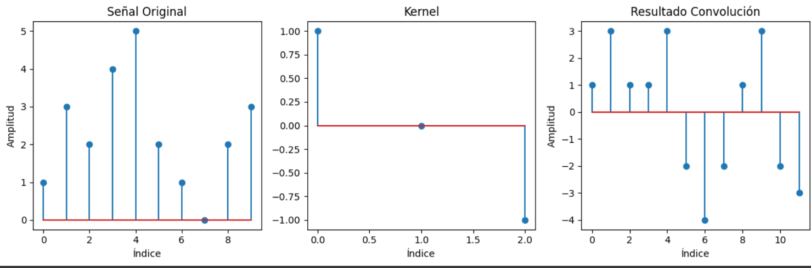

# Ejercicio 3 - Convolución 1D

Se implementa una función desde cero para realizar una convolución unidimensional entre una señal y un kernel.

## Plataforma
ejercicio desarrollado en colab, ingresar al siguiente link con corro institucional
https://colab.research.google.com/drive/1b8GAkqvWe6EScWN3k5rL1NN_1Csg7cyp?usp=sharing

## Código Clave

```python
def convolucion_1d(signal, kernel):
    kernel = kernel[::-1]
    padded = [0]*(len(kernel)-1) + signal + [0]*(len(kernel)-1)
    result = [sum(padded[i+j]*kernel[j] for j in range(len(kernel))) 
              for i in range(len(signal) + len(kernel) - 1)]
    return result
```

## Resultados

- `resultados.png`

## Vista de Imágenes


